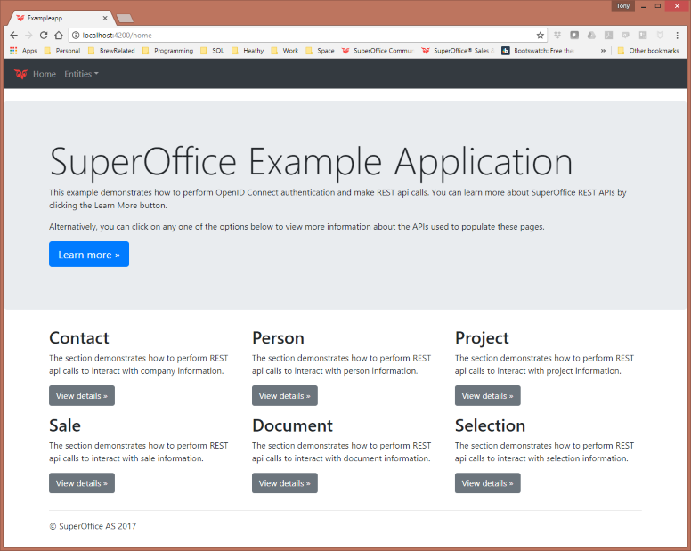

# SuperOffice DevNet Example Application #

An example Angular web application that demonstrates how to authenticate with SuperOffice Online using OpenID Connect, as how a client might use REST services to get, create, and delete Companys, Contacts, Sales, Projects, etc.

## Getting Started ##

This example builds off an article by Scott Bradly, entitled ["SPA Authentication using OpenID Connect, Angular CLI and oidc-client"](https://www.scottbrady91.com/Angular/SPA-Authentiction-using-OpenID-Connect-Angular-CLI-and-oidc-client).

It leverages the [OpenId Connect javascript client](https://github.com/IdentityModel/oidc-client-js) and demonstrates Implicit Grant flow.

## Build ##

Clone the repository on to your machine, then open the folder using a code editor such as Visual Studio Code. Open a terminal/console window in the same folder and then type the following to have npm install the node_modules folder and dependencies:

    npm install

To run the example, type the following in the terminal/console window to run the application:

    ng serve

Finally, open a browser to [http://localhost:4200](http://localhost:4200) and you should see the main page as seen above.

Each of the lower blocks are access protected. Trying to click on and navigate to each area and will invoke the OpenID Connect library, forward you to the development environment of SuperOffice CRM Online (SOD) and require your to sign in. Once authentication is successful, you will be returned to the area you tried to access.

Explore each area and see how it is possible to view data from SuperOffice CRM Online, as well as create new and delete entities.

Explore the code and view how the application works. All REST service calls reside in the services folder and respective service typescript file.

All [REST apis are well documented here](https://community.superoffice.com/documentation/sdk/SO.NetServer.Web.Services/html/Reference-WebAPI-REST-REST.htm) on the community website.

## Dislaimer ##

This is a first attempt at creating an Angular application and has some inconsistancies. For example, all components use an html template, except the contact-detail.component.ts file. The contact-detail uses an inline template as a means to explore that option. Another discrepancy is the existance of a Contact typescript interface. It's referenced a couple places in the Contact service, but no other service (project, sale, person, etc) uses an interface or typescript class for managing JSON representations of SuperOffice entities. That may come in the future, as a npm package, but does not exist today - please do not ask for it.

This id **not** an Angular or TypeScript tutorial, just an example application that demonstrates how to leverage openid connect for authentication and accessing SuperOffice REST endpoints.
